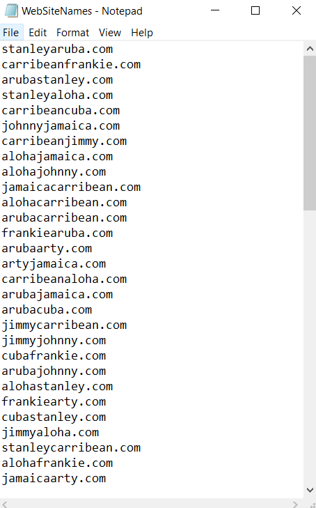

# website-name-generator

Oftentimes, people stumble upon an idea for a product, service, app, etc. but have difficulty creating a name. The website name generator is a simple python script to generate and find available domain names.

Below is an example of the project's output:



## To Use

To use this project copy website_name_generator python file, enter up to twenty three words in the prompt, and run the file! More detailed directions here: https://mikeodonnell.work/2018/03/21/web-site-name-generator/

```sh
siteNameGenerator(words)
```

## Prerequisites

Python 2.7

## Author

Michael O'Donnell
mro4354@gmail.com
